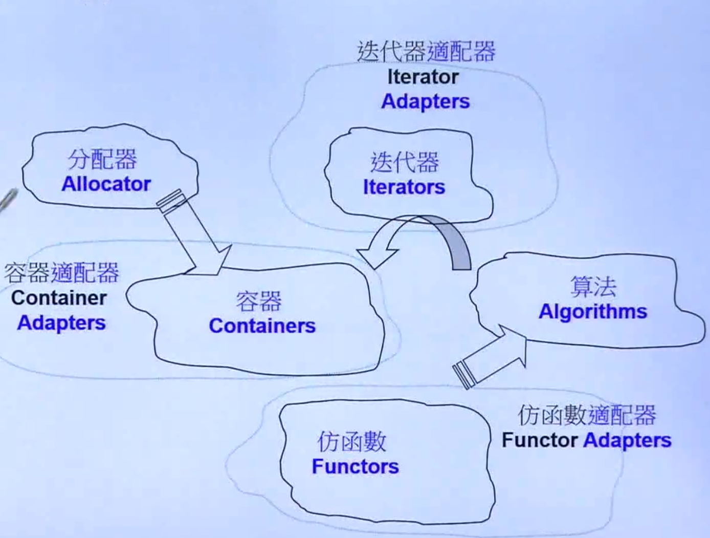

# STL的基本组成部分

## 广义上讲 : STL 分为 算法、容器、迭代器
## 详细的说 : STL 分为 容器、算法、迭代器、仿函数、适配器、空间配置器

1. ## 容器
   1. **是一种数据结构，以模板类的方法提供**
2. ## 算法
   1. **用来操作容器中的数据的模板函数，如排序、复制等，不同容器还有特定的算法**
3. ## 迭代器
   1. **提供了访问容器中对象的方法，在不暴露容器内部结构的情况下对容器的遍历**
4. ## 仿函数
   1. **如果一个类将 () 运算符重载为成员函数，这个类就称为函数对象类，这个类的对象就是函数对象（又称仿函数）**
5. ## 适配器
   1. **修改或调用现用类的接口和函数来提供新的接口或实现新的功能**
   2. **分为：**
      - **容器适配器**  
      - **迭代器适配器**  
      - **仿函数适配器**  
6. ## 空间配置器 Allocator
   1. **对象的创建和销毁**
   2. **内存的获取和释放**
   
##  他们之间的关系：分配器给容器分配存储空间，算法通过迭代器获取容器中的内容，仿函数可以协助算法完成各种操作，配接器用来套接适配仿函数 