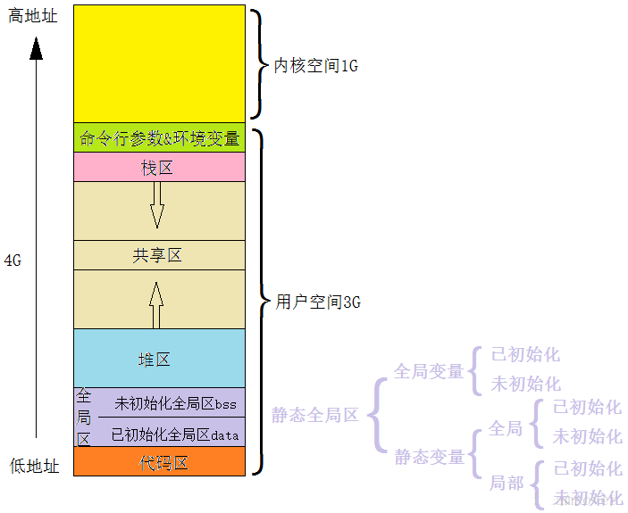

# **程序有哪些section**

一个程序有哪些section：

如上图，从低地址到高地址，一个程序由代码段、数据段、 BSS 段组成。

    数据段：存放程序中已初始化的全局变量和静态变量的一块内存区域。

    代码段：存放程序执行代码的一块内存区域。只读，代码段的头部还会包含一些只读的常数变量。

    BSS 段：存放程序中未初始化的全局变量和静态变量的一块内存区域。

    可执行程序在运行时又会多出两个区域：堆区和栈区。

    堆区：动态申请内存用。堆从低地址向高地址增长。

    栈区：存储局部变量、函数参数值。栈从高地址向低地址增长。是一块连续的空间。

    最后还有一个文件映射区，位于堆和栈之间。
