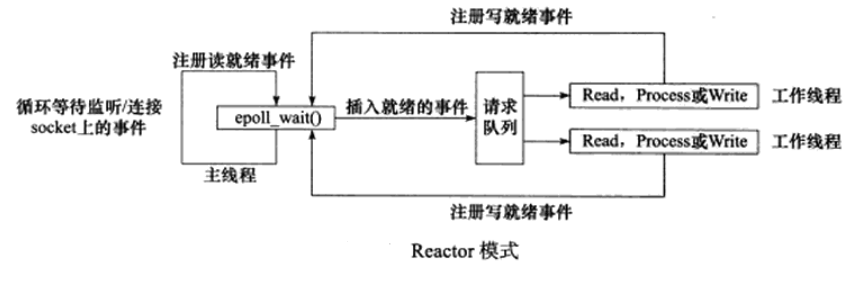
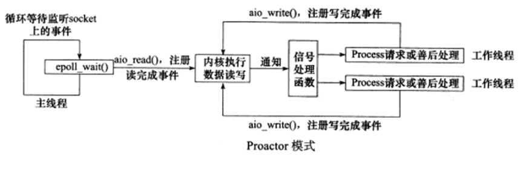

# Reactor、Proactor模式

在高性能I/O设计中，**Reactor模式用于同步IO**， **Proactor用于异步IO**

## Reactor模式：
1.  应用程序注册读就需事件和相关联的事件处理器

2.  事件分离器等待事件的发生

3.  当发生读就需事件的时候，事件分离器调用第一步注册的事件处理器

4.  事件处理器首先执行实际的读取操作，然后根据读取到的内容进行进一步的处理

## Proactor模式：
1.  应用程序初始化一个异步读取操作，然后注册相应的事件处理器，此时事件处理器不关注读取就绪事件，而是关注读取完成事件，这是区别于Reactor的关键。

1.  事件分离器等待读取操作完成事件

1.  在事件分离器等待读取操作完成的时候，操作系统调用内核线程完成读取操作，并将读取的内容放入用户传递过来的缓存区中。这也是区别于Reactor的一点，Proactor中，应用程序需要传递缓存区。

1.  事件分离器捕获到读取完成事件后，激活应用程序注册的事件处理器，事件处理器直接从缓存区读取数据，而不需要进行实际的读取操作。

## 区别：
从上面可以看出，Reactor中需要**应用程序自己读取或者写入数据**，而Proactor模式中，应用程序不需要用户再自己接收数据，直接使用就可以了，操作系统会将数据从**内核拷贝到用户区**。