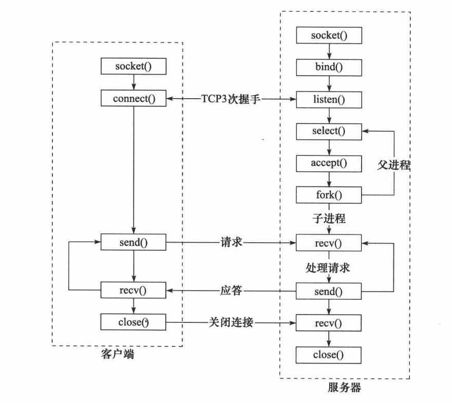

# socket网络编程中客户端和服务端用到哪些函数

## 服务端：
1.  **`socket`创建一个套接字**
2.  **`bind`绑定ip和port**
3.  **`listen`使套接字变为可以被动链接（监听）**
4.  **`accep`等待客户端连接**
5.  **`write/read`接收发送数据**
6.  **`close`关闭连接**

## 客户端：
1.  **创建一个socket，用函数`socket()`**
2.  **`bind`绑定ip和port**
3.  **连接服务器，用函数`connect()`**
4.  **收发数据，用函数`send()和recv()`,或`read()和write()`**
5.  **`close`关闭连接**



```cpp
// 服务端
#include <arpa/inet.h>
#include <ctype.h>
#include <fcntl.h>
#include <netinet/in.h>
#include <stdio.h>
#include <stdlib.h>
#include <string.h>
#include <sys/socket.h>
#include <sys/types.h>
#include <unistd.h>

int main(int argc, char *argv[]) {
    if (argc < 2) {
        fprintf(stderr, "Usage: %s port\n", argv[0]);
        return EXIT_FAILURE;
    }
    int port = atoi(argv[1]);

    // 1、创建监听用的文件描述符
    int lfd = socket(AF_INET, SOCK_STREAM, 0); // TCP/IP协议簇
    if (lfd == -1) {
        perror("socket error");
        return EXIT_FAILURE;
    }

    // 2、将监听文件描述符和IP端口信息绑定
    struct sockaddr_in addr;
    addr.sin_family = AF_INET; // TCP/IP协议簇
    addr.sin_addr.s_addr = htonl(INADDR_ANY); // 表示任意可用IP
    addr.sin_port = htons(port);              // 转换成网络字节序（大端字节序）

    int ret = bind(lfd, (struct sockaddr *)&addr, sizeof(addr));
    if (ret == -1) {
        perror("bind error");
        return EXIT_FAILURE;
    }

    // 3、监听文件描述符
    if ((ret = listen(lfd, 128)) == -1) { // 请求队列的最大长度 128
        perror("listen error");
        return EXIT_FAILURE;
    }

    printf("[%d]The server is running at %s:%d\n", getpid(), inet_ntoa(addr.sin_addr), port);
    // 进程号：getpid()

    // 4、接受一个socket连接（从已连接队列中获取一个连接进行服务），并返回连接文件描述符。
    struct sockaddr_in clientAddr;                // 输入参数
    socklen_t clientAddrLen = sizeof(clientAddr); // 同时作为输入和输出参数
    int cfd = accept(lfd, (struct sockaddr *)&clientAddr, &clientAddrLen); // 阻塞等待客户端 connect
    if (cfd == -1) {
        perror("accept error");
        return EXIT_FAILURE;
    }
    char clientIP[16];
    memset(clientIP, 0x00, sizeof(clientIP));
    inet_ntop(AF_INET, &clientAddr.sin_addr, clientIP, sizeof(clientIP)); // 将网络字节序的整数IP转换成主机字节序的点分十进制字符串
    int clientPort = ntohs(clientAddr.sin_port);                          // 将网络字节序转换成主机字节序
    printf("Accept client: %s:%d\n", clientIP, clientPort);

    // 5、读写连接
    char buf[BUFSIZ];
    ssize_t size;
    for (;;) {
        // 初始化buffer
        memset(buf, 0x00, sizeof(buf));
        // 读取客户端信息
        size = read(cfd, buf, sizeof(buf));
        if (size == 0) { // zero indicates end of file
            printf("The client is closed\n");
            break;
        }
        if (size == -1) {
            perror("read error");
            continue;
        }
        printf("read: %s\n", buf);

        for (int i = 0; i < strlen(buf); i++) {
            buf[i] = toupper(buf[i]);
        }

        // 发送信息给客户端
        size = write(cfd, buf, strlen(buf));
        if (size == -1) {
            perror("write error");
            continue;
        }
        printf("write: %s\n", buf);
    }

    close(lfd);
    close(cfd);

    printf("The server is shut down\n");
    return EXIT_SUCCESS;
}
```

```cpp
//客户端
#include <arpa/inet.h>
#include <ctype.h>
#include <netinet/in.h>
#include <stdio.h>
#include <stdlib.h>
#include <string.h>
#include <sys/socket.h>
#include <sys/types.h>
#include <unistd.h>

int main(int argc, char *argv[]) {
    if (argc < 3) {
        fprintf(stderr, "Usage: %s host port\n", argv[0]);
        return EXIT_FAILURE;
    }
    char *host = argv[1];
    int port = atoi(argv[2]);

    int cfd = socket(PF_INET, SOCK_STREAM, IPPROTO_TCP); // 协议指定为TCP
    if (cfd == -1) {
        perror("socket error");
        return EXIT_FAILURE;
    }

    struct sockaddr_in addr;
    addr.sin_family = AF_INET;
    addr.sin_addr.s_addr = inet_addr(host); // 方式一
    // inet_pton(AF_INET, host, &addr.sin_addr.s_addr); // 方式二
    addr.sin_port = htons(port);

    int ret = connect(cfd, (struct sockaddr *)&addr, sizeof(addr));
    if (ret == -1) {
        perror("connect error");
        return EXIT_FAILURE;
    }

    printf("The remote server is connected -> %s:%d\n", host, port);

    char buf[BUFSIZ];
    ssize_t size;
    for (int i = 0; i < 10; i++) {
        printf("Please enter content:\n");
        memset(buf, 0x00, sizeof(buf)); 
        if ((size = read(STDIN_FILENO, buf, sizeof(buf))) <= 0) { // 接收键盘的输入 STDIN_FILENO
            continue;
        }

        if ((size = write(cfd, buf, strlen(buf))) == -1) { // 往内核的发送缓冲区中写入数据（由内核决定何时发送数据）
            perror("write error");
            break;
        }

        memset(buf, 0x00, sizeof(buf));
        size = read(cfd, buf, sizeof(buf));
        if (size == -1) {
            perror("read error");
            break;
        }
        if (size == 0) { // zero indicates end of file
            printf("The server is shut down\n");
            break;
        }
        printf("Reply: %s\n", buf);
    }
    close(cfd);
    printf("The client is closed\n");
    return EXIT_SUCCESS;
}
```