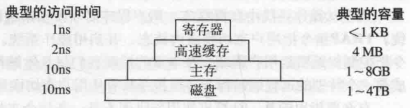

# **操作系统管理内存**

## **物理内存：物理内存有四个层次，分别是寄存器、高速缓存、主存、磁盘。**

## 寄存器：速度最快、量少、价格贵。

## 高速缓存：次之。

## 主存：再次之。

## 磁盘：速度最慢、量多、价格便宜。

**操作系统会对物理内存进行管理，有一个部分称为内存管理器(memory manager)，它的主要工作是有效的管理内存，记录哪些内存是正在使用的，在进程需要时分配内存以及在进程完成时回收内存。**
