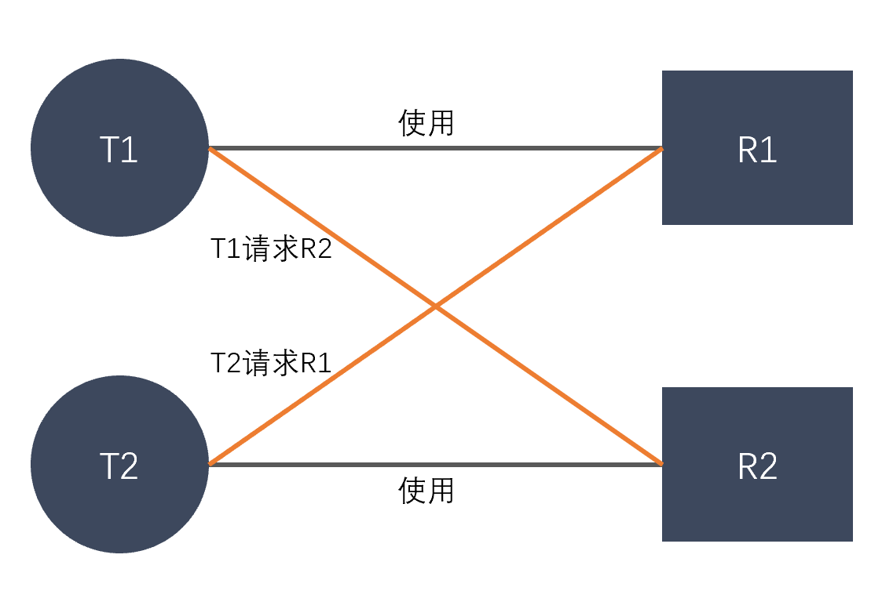

# 死锁
## 死锁：
**是指多个进程在执行过程中，因争夺资源而造成的相互等待。此时系统产生了死锁。比如两只?过桥，互不相让，产生死锁**

## 产生条件：
1.  **互斥条件：**进程对所分配到的资源不允许其他进程访问，若其他进程访问，只能等待，直到进程使用完成后释放资源。
2.  **请求保持条件：**进程获得一定资源后，又对其他资源发出请求，但该资源被其他进程占有，此时请求阻塞，而该进程不会释放自己已经占有的资源。
3.  **不可剥夺条件：**进程以获得的资源，只能自己释放，不可剥夺。
4.  **环路等待资源：**若进程之间形成一种头尾相连的循环等待资源关系。

## 如何解决：
1.  **资源一次性分配，从而解决请求保持问题**
2.  **可剥夺资源：进程新的资源没等到满足时，释放已有的资源**
3.  **资源有序分配：资源按序号递增，进程请求按递增请求，释放则相反**

