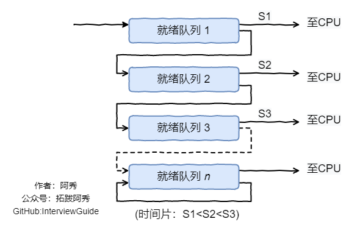

# **进程调度算法**
## 1、 先来先服务 first-come first-serverd（FCFS）

### **非抢占式的调度算法，按照请求的顺序进行调度。**
### **有利于长作业，但不利于短作业，因为短作业必须一直等待前面的长作业执行完毕才能执行，而长作业又需要执行很长时间，造成了短作业等待时间过长。**

 

## 2、 短作业优先 shortest job first（SJF）

### **非抢占式的调度算法，按估计运行时间最短的顺序进行调度。**

### **长作业有可能会饿死，处于一直等待短作业执行完毕的状态。因为如果一直有短作业到来，那么长作业永远得不到调度。**

 

## 3、最短剩余时间优先 shortest remaining time next（SRTN）

### **最短作业优先的抢占式版本，按剩余运行时间的顺序进行调度。 当一个新的作业到达时，其整个运行时间与当前进程的剩余时间作比较。**

### **如果新的进程需要的时间更少，则挂起当前进程，运行新的进程。否则新的进程等待。**

 

## 4、时间片轮转

### **将所有就绪进程按 FCFS 的原则排成一个队列，每次调度时，把 CPU 时间分配给队首进程，该进程可以执行一个时间片。**

### **当时间片用完时，由计时器发出时钟中断，调度程序便停止该进程的执行，并将它送往就绪队列的末尾，同时继续把 CPU 时间分配给队首的进程。**

### **时间片轮转算法的效率和时间片的大小有很大关系：**

**因为进程切换都要保存进程的信息并且载入新进程的信息，如果时间片太小，会导致进程切换得太频繁，在进程切换上就会花过多时间。而如果时间片过长，那么实时性就不能得到保证**

 

## 5、优先级调度

### **为每个进程分配一个优先级，按优先级进行调度。**

### **为了防止低优先级的进程永远等不到调度，可以随着时间的推移增加等待进程的优先级。**

 

## 6、多级反馈队列

### **一个进程需要执行 100 个时间片，如果采用时间片轮转调度算法，那么需要交换 100 次。**

### **多级队列是为这种需要连续执行多个时间片的进程考虑，它设置了多个队列，每个队列时间片大小都不同，例如 1,2,4,8,..。进程在第一个队列没执行完，就**会被移到下一个队列。

### **这种方式下，之前的进程只需要交换 7 次。每个队列优先权也不同，最上面的优先权最高。因此只有上一个队列没有进程在排队，才能调度当前队列上的进程。**

### **可以将这种调度算法看成是时间片轮转调度算法和优先级调度算法的结合。**

 

## 抢占式和非抢占式

1.  非抢占式优先权算法
在这种方式下，系统一旦把处理机分配给就绪队列中优先权最高的进程后，该进程便一直执行下去，直至完成；或因发生某事件使该进程放弃处理机时，系统方可再将处理机重新分配给另一优先权最高的进程。这种调度算法主要用于批处理系统中；也可用于某些对实时性要求不严的实时系统中。

1.  抢占式优先权调度算法
在这种方式下，系统同样是把处理机分配给优先权最高的进程，使之执行。但在其执行期间，只要又出现了另一个其优先权更高的进程，进程调度程序就立即停止当前进程(原优先权最高的进程)的执行，重新将处理机分配给新到的优先权最高的进程。因此，在采用这种调度算法时，是每当系统中出现一个新的就绪进程i 时，就将其优先权Pi与正在执行的进程j 的优先权Pj进行比较。如果Pi≤Pj，原进程Pj便继续执行；但如果是Pi>Pj，则立即停止Pj的执行，做进程切换，使i 进程投入执行。显然，这种抢占式的优先权调度算法能更好地满足紧迫作业的要求，故而常用于要求比较严格的实时系统中，以及对性能要求较高的批处理和分时系统中。

