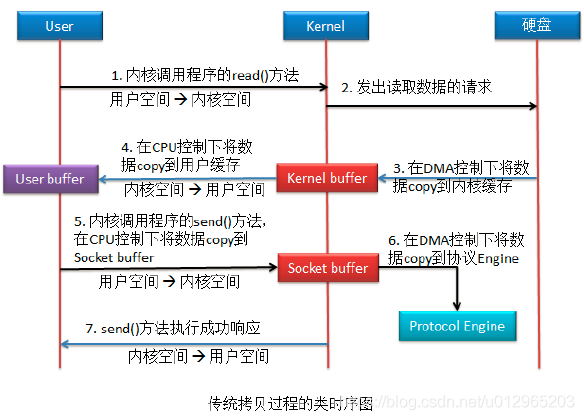
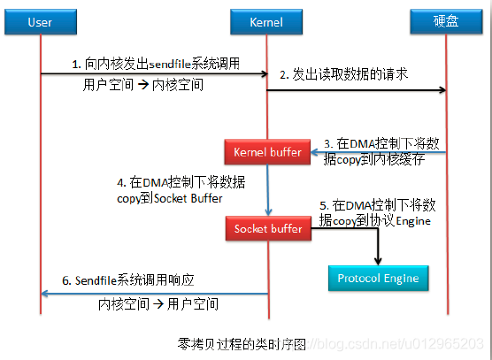

# 零拷贝

## 什么是零拷贝：
**所谓零拷贝描述的是计算机操作系统当中，CPU不执行将数据从一个内存区域，拷贝到另一个内存区域的任务。通过网络传输文件时，这样通常可以节省CPU周期和内存带宽。**

## 传统拷贝方式

**发生4次空间切换（1、4、5、7），发生4次拷贝（3、4、5、6），其中有2次CPU（4、5）参与**

## 零拷贝原理：Linux 提供了 sendfile() 用来减少我们的数据拷贝和上下文切换次数。

**发生2次空间切换(1、6)，发生3次copy（3、4、5），其中有0次CPU参与**

## 零拷贝的好处
1.  **节省CPU周期，空出的CPU可以完成更多其它的任务**
2.  **减少了内存区域一见到数据拷贝，节省内存带宽**
3.  **减少用户态和内核态之间数据拷贝，提升数据传输效率**
4.  **应用零拷贝技术，减少用户态和内核态的上下文切换**