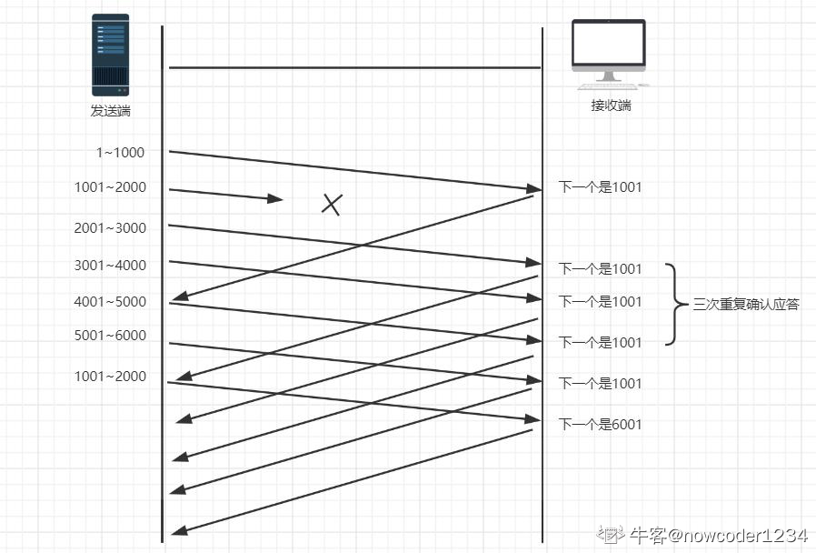

# TCP可靠性保证
## TCP主要提供了检验和`、`序列号/确认应答`、`超时重传`、`最大消息长度`、`滑动窗口控制、拥塞控制等方法实现了可靠性传输。

+   ### 检验和
    +   **通过就检验和的方式，接收端可以检验出来数据是否有差错和异常，假如有差错会直接丢弃TCP段，重新发送。TCP在计算检验和时，会在TCP首部加上一个12字节的伪首部。检验和总共计算3部分：TCP首部、TCP数据据、TCP伪首部**
    
+   ### 序列号/确认应答
    +   **这个机制类似于回答的形式。只要发送端有一个包传输，接收端没有回应确认包(ACK包)，都会重发。或者接收端的应答包，发送端没有收到也会重发数据，这就可以保证数据的完整性。**
       
+   ### 超时重传
    +   **超时重传是指发送出去的数据包到接收到确认包之间的时间，如果超过这个时间会被认为是丢包了，需要重传。**
    +   **RTT(往返时间)等于发送时间加接收时间，然后可能由于网络原因，时间会有偏差，称为抖动。综上超时重传时间稍大于 RTT + 抖动值**
    +   **但是在重发的过程中，假如一个包经过多次的重发也没有收到对端的确认包，那么就会认为接收端异常，强制关闭连接。并且通知应用通信异常强行终止。**
     
+   ### 最大消息长度
    +   **在建立TCP链接的时候，双方约定一个最大的长度(MSS)作为发送的单位，重传的时候也是以这个单位进行重传的。理想情况下是该长度的数据刚好不被网络层分块jk**
    
+   ###  滑动窗口控制
    +   **滑动窗口的大小就是在无需等待确认包的情况下，发送端还能发送端最大数据量。这个机制的实现就是使用了大量的缓冲区，通过多个端进行确认应答的功能。通过下一次的确认包，可以判断接收端是否已经接收到了数据，如果已经接收了就从缓冲区删除掉数据** 
    
    
    +   **如上图，接收端在没有收到自己所期望的序列号数据之前，会对之前的数据进行重复确认。发送端在收到某个应答包之后，又连续3次收到同样的应答包，则数据已经丢失了，需要重发。**
+   ### 拥塞控制
    +   **如果网络非常拥堵，此时再发送数据就会加重网络负担，那么发送的数据段很可能超过了最大生存时间也没有到达接收方，就会产生丢包问题。为此TCP引入慢启动机制，先发出少量数据，就像探路一样，先摸清当前的网络拥堵状态后，再决定按照多大的速度传送数据。**
    +   **发送开始时定义拥塞窗口大小为1；每次收到一个ACK应答，拥塞窗口加1；而在每次发送数据时，发送窗口取拥塞窗口与接送段接收窗口最小者。**
    