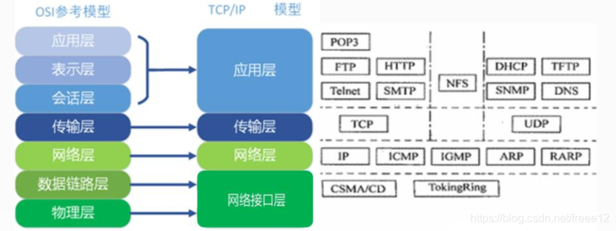

## 应用层协议
|协议| 基于传输层协议|
|:---:|:---:|
|FTP(File Transport Protocol，文件传输协议)            |基于TCP 
|TFTP(Trivial File Transfer Protocol，简单文件传输协议)|基于TCP 
|HTTP(Hypertext Transfer Protocol，超文本传输协议)     |基于TCP 
|SMTP(Simple Mail Transfer Protocol，简单邮件传输协议) |基于TCP 
|DHCP(Dynamic Host Configuration，动态主机配置协议)    |基于UDP 
|Telnet(远程登录协议)                            |基于TCP
|DNS (Domain Name System)域名系统 |基于UDP

## 网络层协议
**ARP(Address Resolution Protocol)地址解析协议 网络层协议，作用：通过IP找到对应的MAC地址**
**RARP (Reverse Address Resolution Protocol)逆地址解析协议 网络层协议，作用：通过MAC地址找到对应的IP**
**ICMP (Internet Control Message Protocol)网际控制报文协议 网络层协议**

 

## TCP的6种标示
+ **SYN(synchronous建立联机)**
+ **ACK(acknowledgement 确认)**
+ **PSH(push传送)** 
+ **FIN(finish结束)**
+ **RST(reset重置)**
+ **URG(urgent紧急)**

 
 

## TCP传输中的有关数据
MTU (Maximum Transfer Unit)最大传送单元

MSS (Maximum Segment Size)最长报文段

**MSS = MTU - IP头部 - TCP/UDP头部**

RTT(Round Trip Time)一个连接的往返时间，即数据发送时刻到接收到确认的时刻的差值；

RTO(Retransmission Time Out)重传超时时间，即从数据发送时刻算起，超过这个时间便执行重传。